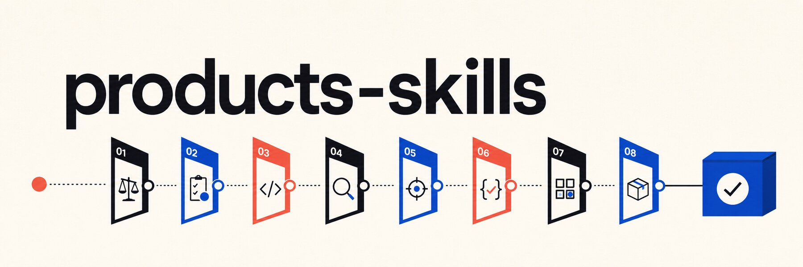

<div align="center">



# products-skills

**让 AI 不只会把需求做出来，还能判断方向、控制范围、验证结果并完成交付。**

[](CHANGELOG.md)
[](#一条自适应的产品交付链路)
[](#快速安装)
[](#快速安装)
[](LICENSE)

[快速安装](#快速安装) · [工作流](#一条自适应的产品交付链路) · [使用示例](#直接这样用) · [English](README.en.md)

</div>

## AI 很会写代码，但产品失败通常发生在写代码之前

用户是谁没有说清楚，第一版大得无法验证，bug 没查根因就直接打补丁，页面没真正跑过却宣布完成。这些问题不是“代码能力不足”，而是关键产品动作被跳过了。

`products-skills` 是一套公开、可复用的 AI 产品落地技能包。它把一个模糊想法推进成可以判断、可以拆解、可以验证、可以交付的产品结果。

> **人人都可以是产品经理。AI 也应该在正确的节点做产品判断。**

它不会强迫每个需求走完一套沉重流程。总路由会识别当前状态，只选择最小有用阶段：方向不清先收敛，根因未知先调查，已经完成则直接进入 QA 和交付。

## 快速安装

同时安装到 Codex 和 Claude Code：

```powershell
npx skills add DOIT-Ben/products-skills -g -a codex claude-code -y --full-depth
```

只安装到 Codex：

```powershell
npx skills add DOIT-Ben/products-skills -g -a codex -y --full-depth
```

只查看将要发现的 Skills：

```powershell
npx skills add DOIT-Ben/products-skills --list --full-depth
```

安装后重启 Agent 会话，让技能列表刷新。`--full-depth` 不能省略，因为 8 个阶段 Skill 位于子目录中。

## 直接这样用

```text
Product：我想做一个习惯追踪小应用，先判断第一版应该解决什么。
```

```text
走 products，把这个想法拆成可以验证、可以执行的产品计划。
```

```text
用 products 看这个 bug。先找根因，不要直接打补丁。
```

```text
Run products QA for this page flow and tell me if it is ship-ready.
```

正式名称是 `products-skills`，也支持 `product`、`products`、`product-skills`、`用 products` 和 `走 products`。

## 一条自适应的产品交付链路

| 阶段 | Skill | 它负责回答什么 | 可能结论 |
| --- | --- | --- | --- |
| 1 | `products-brainstorming` | 用户、问题和成功标准清楚了吗？ | `continue` / `revise` / `stop` |
| 2 | `products-autoplan` | 这个方向值得继续吗？第一版够小吗？ | `continue` / `revise` / `stop` |
| 3 | `products-writing-plans` | 能否拆成有验证项的可执行任务？ | `continue` / `revise` |
| 4 | `products-plan-eng-review` | 架构、数据流、依赖和错误处理可靠吗？ | `continue` / `revise` |
| 5 | `products-investigate` | 异常真正来自哪里？ | `continue` / `revise` / `fix-next` / `stop` |
| 6 | `products-test-driven-development` | 如何用测试证明行为变化？ | `continue` / `revise` / `fix-next` |
| 7 | `products-qa` | UI、CLI 或真实流程是否达到验收标准？ | `ship-ready` / `fix-next` / `revise` |
| 8 | `products-ship` | 验证、风险、回滚和交接是否完整？ | `ship-ready` / `fix-next` / `stop` |

### 路由不是流水线

- 只有模糊想法：从 `products-brainstorming` 开始。
- 已有明确方向：可以直接进入计划或工程评审。
- bug 根因未知：必须先走 `products-investigate`。
- 根因已知并要改变行为：进入 TDD。
- 实现已经完成：从 QA 开始，不重走前面的阶段。

## 五个关口结论

| 结论 | 含义 |
| --- | --- |
| `continue` | 当前阶段证据足够，可以进入下一个明确阶段 |
| `revise` | 方向、计划或实现仍需调整 |
| `stop` | 不建议按当前方式继续投入 |
| `fix-next` | 存在必须先修复的问题 |
| `ship-ready` | 验证和交接证据足够，可以发布或交付 |

## 你会得到什么

- **更快判断**：先辨别产品价值、风险和范围，而不是一上来开工。
- **更小第一版**：把“大而全”压缩成能快速验证的切片。
- **更稳实施**：先把任务、架构和验收条件说清楚。
- **更少乱修**：根因未知时不允许直接进入补丁模式。
- **更可信交付**：测试、真实运行和可见流程共同支撑结论。

## 支持范围

包元数据兼容 Codex、Claude Code、Cursor、Windsurf、Copilot、Kiro、OpenCode 和 Continue 等 Agent 环境。不同客户端的 Skill 发现与安装能力可能不同，当前推荐使用 `npx skills` 安装。

## 仓库结构

```text
products-skills/
├── SKILL.md                         # 总路由
├── products-brainstorming/
├── products-autoplan/
├── products-writing-plans/
├── products-plan-eng-review/
├── products-investigate/
├── products-test-driven-development/
├── products-qa/
├── products-ship/
├── evals/evals.json
├── skill.json
├── .codex-plugin/plugin.json
└── .claude-plugin/
```

## 发布前验证

```powershell
npx skills add . --list --full-depth
npx skills add . -g -a codex claude-code -y --full-depth
npx skills list -g -a codex --json
npx skills list -g -a claude-code --json
```

场景测试位于 `evals/evals.json`，覆盖模糊想法、产品判断、工程计划、未知根因 bug、QA、交付、非产品短问答和旧名称兼容。

## English

Read the full English documentation in [README.en.md](README.en.md).

## License

[MIT License](LICENSE) © 2026 DOIT-Ben
